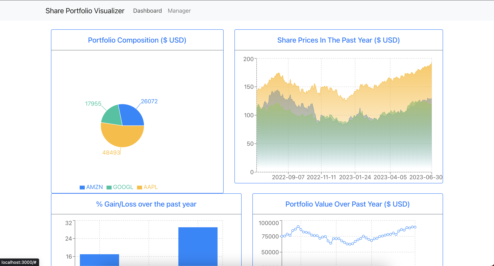

# Share Portfolio Visualizer #

This is a website built in ReactJS designed to help you visualize your stock portfolio. It requires you
to manually add your share portfolio to the program. It will then fetch the last year of daily trading data for each share
and create a series of charts made from the data.

Checkout the video demo [here](https://youtu.be/iyRM1HXFVVA).

Start the program by running "docker-compose up --build" in the root directory. Look at my 
[Javscript Fullstack Boilerplate repository](https://github.com/jakeMartin1234/javascript-fullstack-boilerplate) for
further instructions on how to run/develop the program.

